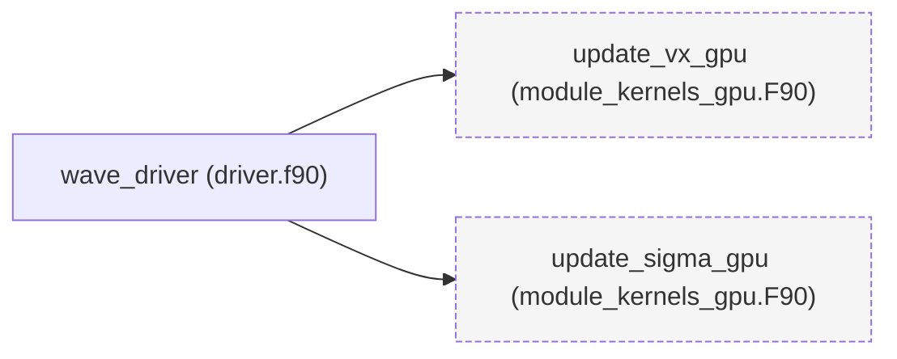

# Portage GPU des Kernels de Simulation Sismique

Ce document décrit le portage GPU des routines Fortran `update_vx` et `update_sigma` pour accélérer les simulations de différences finies. Le portage utilise **OpenACC** pour la parallélisation sur GPU et **Cython** pour l'interopérabilité avec Python.

---

## 📊 Graphe d'Appels

Le graphe ci-dessous montre les dépendances entre le `driver` et les routines GPU :



---

## 🔧 Modifications Apportées

### 1. **`driver.f90`**
Le fichier `driver.f90` a été modifié pour appeler les routines GPU et gérer les transferts mémoire :

#### Changements clés :
- **Remplacement du module** :
  ```fortran
  use wave_kernels, only: update_vx, update_sigma
  ```
  →
  ```fortran
  use module_kernels_gpu, only: update_vx_gpu, update_sigma_gpu
  ```

- **Appel des routines GPU** :
  ```fortran
  call update_vx(vx, sigma_xx, dx, nx, ny)
  call update_sigma(sigma_xx, vx, vy, dx, dy, nx, ny)
  ```
  →
  ```fortran
  call update_vx_gpu(vx, sigma_xx, dx, nx, ny)
  call update_sigma_gpu(sigma_xx, vx, vy, dx, dy, nx, ny)
  ```

- **Ajout des pragmas OpenACC** :
  ```fortran
  !$acc data copy(vx, vy, sigma_xx)
  do step = 1, nsteps
    call update_vx_gpu(vx, sigma_xx, dx, nx, ny)
    call update_sigma_gpu(sigma_xx, vx, vy, dx, dy, nx, ny)
  end do
  !$acc end data
  ```

---

### 2. **Fichiers Générés par Fortranspire**
Les fichiers suivants ont été générés dans le répertoire `output/` :

| Fichier                                      | Rôle                                                                                     |
|----------------------------------------------|------------------------------------------------------------------------------------------|
| `output/fortran_gpu/kernel_pure.f90`         | Version annotée avec `PURE/ELEMENTAL` pour faciliter la traduction.                     |
| `output/fortran_gpu/kernel_gpu.f90`          | Version avec pragmas OpenACC pour le GPU.                                               |
| `output/fortran_gpu/module_kernels_gpu.F90`   | Module Fortran compilable avec OpenACC.                                                 |
| `output/cython/wave_kernels.pyx`             | Wrapper Cython pour appeler les routines GPU depuis Python.                             |
| `output/cython/kernel_c.h`                   | En-tête C pour l'interopérabilité (via `iso_c_binding`).                                |
| `output/Makefile` et `output/compile_gpu.sh` | Scripts de compilation pour le GPU.                                                     |

---

## 🚀 Compilation et Exécution

### 1. **Prérequis**
- **Compilateur** : `nvfortran` (NVIDIA HPC SDK) ou `pgfortran` avec support OpenACC.
- **Architecture GPU** : Une carte NVIDIA compatible (ex: A100, V100, T4).
- **Variables d'environnement** (si compilation distante) :
  ```bash
  export FORTRANSPIRE_GPU_HOST=<ip>
  export FORTRANSPIRE_GPU_USER=<user>
  export FORTRANSPIRE_GPU_KEY=<chemin_vers_clé_ssh>
  ```

---

### 2. **Compilation**
#### Option 1 : Compilation locale (si `nvfortran` est installé)
```bash
cd /Users/loicmaurin/coding-agent/tests/fixtures/equivalence/wave_kernels/output
bash compile_gpu.sh
```

#### Option 2 : Compilation distante (sur un nœud GPU)
```bash
# Transférer les fichiers vers le nœud GPU
rsync -a output/ user@<gpu-host>:~/wave_kernels_gpu/

# Se connecter au nœud GPU et compiler
ssh user@<gpu-host>
cd ~/wave_kernels_gpu
bash compile_gpu.sh
```

#### Vérifier le script `compile_gpu.sh`
Assurez-vous que le script inclut bien :
```bash
nvfortran -acc -gpu=ccXX -o wave_driver_gpu ../driver.f90 fortran_gpu/module_kernels_gpu.F90
```
(Remplacer `ccXX` par l'architecture GPU cible, ex: `cc80` pour A100).

---

### 3. **Exécution**
#### Lancer le binaire GPU
```bash
./wave_driver_gpu
```

#### Comparer les résultats avec la version CPU
- **Sortie standard** : Le `driver` génère une sortie parsable par `pytest` pour valider la précision numérique.
- **Validation** : Utilisez `diff` ou `pytest` pour comparer les sorties CPU et GPU.

Exemple de commande pour comparer les résultats :
```bash
# Générer la sortie CPU
./wave_driver_cpu > cpu_output.txt

# Générer la sortie GPU
./wave_driver_gpu > gpu_output.txt

# Comparer les fichiers
diff cpu_output.txt gpu_output.txt
```

---

## 📈 Validation des Performances

### 1. **Comparaison CPU vs GPU**
Utilisez `fortranspire_profile_kernels` pour comparer les performances :
```bash
fortranspire_profile_kernels --filepath /path/to/original.f90
```

### 2. **Métriques à surveiller**
| Métrique               | Description                                                                                     |
|------------------------|-------------------------------------------------------------------------------------------------|
| **Temps d'exécution** | Temps total pour `nsteps` itérations.                                                          |
| **Accélération**       | Rapport entre le temps CPU et le temps GPU.                                                     |
| **Précision numérique** | Écart maximal entre les résultats CPU et GPU (doit être < 1e-12 pour `real(8)`).               |

---

## 🛠️ Recommandations

### 1. **Optimisations supplémentaires**
- **Transferts mémoire** : Utilisez `!$acc data copyin/copyout` pour minimiser les transferts CPU-GPU.
- **Parallélisme** : Ajustez les clauses `collapse` dans les pragmas OpenACC pour optimiser l'occupation GPU.
- **Précision** : Vérifiez que le GPU cible supporte bien `real(8)` (double précision).

### 2. **Débogage**
- **Compilation avec debug** : Ajoutez `-g -Mbounds` à `nvfortran` pour activer les checks de bounds.
- **Profiling** : Utilisez `nvprof` ou `nsight` pour identifier les goulots d'étranglement.

### 3. **Intégration Python**
Si vous souhaitez appeler les routines GPU depuis Python :
```python
import pyximport; pyximport.install()
import wave_kernels

# Initialiser les tableaux
vx = np.zeros((nx, ny), dtype=np.float64)
sigma_xx = np.zeros((nx, ny), dtype=np.float64)

# Appeler la routine GPU
wave_kernels.update_vx_gpu(vx, sigma_xx, dx, nx, ny)
```

---

## ⚠️ Limitations Connues

| Limitation                          | Solution                                                                                     |
|-------------------------------------|---------------------------------------------------------------------------------------------|
| **Compilation locale impossible**   | Utilisez un nœud GPU distant ou installez `nvfortran`.                                      |
| **Précision numérique**             | Vérifiez que le GPU supporte `real(8)`. Sinon, utilisez `real(4)` avec une tolérance ajustée. |
| **Transferts mémoire coûteux**      | Minimisez les transferts avec `!$acc data` et utilisez des tableaux GPU-only.               |

---

## 📂 Arborescence des Fichiers

```
wave_kernels/
├── original.f90            # Code CPU original
├── openacc.f90             # Version OpenACC de référence (si disponible)
├── driver.f90              # Driver modifié pour le GPU
├── output/
│   ├── fortran_gpu/
│   │   ├── kernel_pure.f90   # Version annotée PURE/ELEMENTAL
│   │   ├── kernel_gpu.f90    # Version OpenACC
│   │   └── module_kernels_gpu.F90  # Module compilable
│   ├── cython/
│   │   ├── wave_kernels.pyx  # Wrapper Cython
│   │   └── kernel_c.h       # En-tête C
│   ├── Makefile            # Makefile pour la compilation
│   └── compile_gpu.sh      # Script de compilation GPU
└── PORTING_GPU.md          # Ce fichier
```