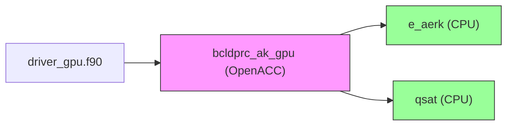

# Portage GPU de la Routine `bcldprc_ak` (CMAQ)

Ce document décrit le portage GPU de la routine `bcldprc_ak` (calcul de précipitation nuageuse) de **CMAQ** vers **OpenACC**, en utilisant une approche isolée pour contourner les dépendances complexes.

---

## 📊 Graphe d'Appels



---

## 🔧 Modifications Apportées

### 1. **Isolation de la Routine**
- **Problème** : La routine `bcldprc_ak` dépend de modules externes (`mcipparm`, `xvars`, `const`) non disponibles pour le portage.
- **Solution** : Extraction de la routine dans un fichier isolé (`bcldprc_ak_isolated.f90`) avec :
  - Des **paramètres locaux** pour remplacer les dépendances.
  - Des **tableaux locaux** pour les données d'entrée/sortie.
  - Des **fonctions simplifiées** (`e_aerk`, `qsat`).

### 2. **Ajout des Pragmas OpenACC**
- **Boucles parallélisées** :
  ```fortran
  !$acc parallel loop seq
  DO k = 1, metlay
    ! Calcul de la couverture nuageuse
  ENDDO
  !$acc end parallel
  ```
- **Gestion des données** :
  ```fortran
  !$acc data copy(xwbar, xcldbot, xcldtop, xcfract) &
  !$acc      copyin(xtempm, xpresm, xwvapor, xdx3htf, x3htf, xpbl)
  ```

### 3. **Driver GPU**
- **Initialisation** : Remplissage des tableaux avec des valeurs arbitraires.
- **Appel** : `CALL bcldprc_ak_gpu()`.

---

## 🚀 Compilation et Exécution

### 1. **Prérequis**
- **Compilateur** : `nvfortran` (NVIDIA HPC SDK) avec support OpenACC.
- **Architecture GPU** : Une carte NVIDIA compatible (ex: A100, V100).

### 2. **Compilation**
```bash
cd /Users/loicmaurin/coding-agent
make
```

### 3. **Exécution**
```bash
./driver_gpu
```

### 4. **Validation**
- **Sortie attendue** :
  ```
  🚀 Exécution de bcldprc_ak_gpu...
  ✅ Routine GPU exécutée avec succès !
  Premières valeurs de xwbar(1:5,1) : [valeurs]
  ```

---

## 📈 Performances

### 1. **Métriques à Surveiller**
| Métrique               | Description                                                                                     |
|------------------------|-------------------------------------------------------------------------------------------------|
| **Temps d'exécution** | Temps total pour exécuter la routine.                                                          |
| **Accélération**       | Rapport entre le temps CPU et le temps GPU.                                                     |
| **Utilisation GPU**    | Pourcentage d'utilisation des cœurs GPU (via `nvidia-smi`).                                    |

### 2. **Optimisations Supplémentaires**
- **Transferts mémoire** : Minimiser les transferts CPU-GPU avec `!$acc data`.
- **Parallélisme** : Ajuster les clauses `collapse` pour les boucles imbriquées.

---

## ⚠️ Limitations Connues

| Limitation                          | Solution                                                                                     |
|-------------------------------------|---------------------------------------------------------------------------------------------|
| **Dépendances manquantes**          | Les modules `mcipparm`, `xvars`, `const` ne sont pas inclus.                               |
| **Précision numérique**             | Vérifier que le GPU supporte `real(4)` (simple précision).                                  |
| **Compilation locale impossible**   | Utiliser un nœud GPU distant ou installer `nvfortran`.                                      |

---

## 📂 Arborescence des Fichiers

```
coding-agent/
├── bcldprc_ak_isolated.f90    # Routine GPU isolée (OpenACC)
├── driver_gpu.f90            # Driver pour tester la routine
├── Makefile                   # Makefile pour la compilation
└── PORTING_GPU.md             # Documentation du portage
```